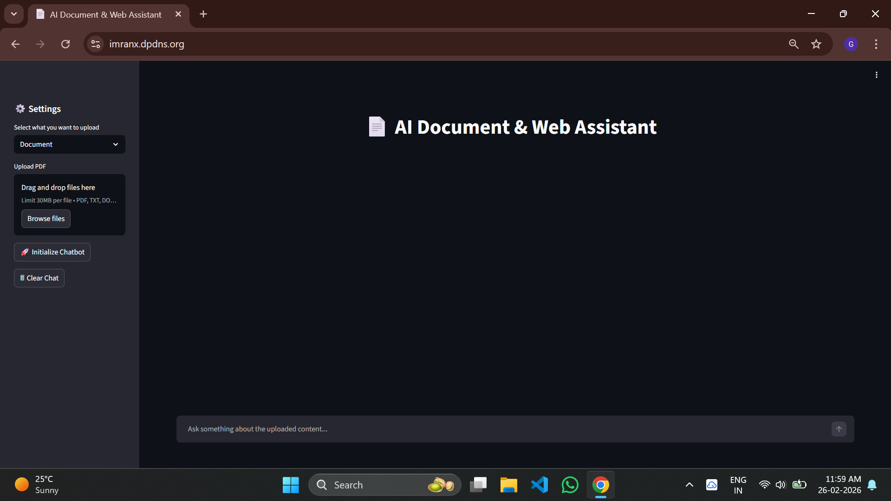

# 📄 AI PDF Summarizer

Access the site at :- https://imranx.dpdns.org

## Project Site Image




A production-ready **RAG Based AI-powered PDF Summarizer** built with:

- 🧠 Hugging Face API For Embeddings
- 🔎 Semantic search
- 🌐 Streamlit frontend
- 🐳 Dockerized environment
- ☁️ AWS EC2 deployment
- 🔁 GitHub Actions CI/CD
- 🔐 Nginx + SSL (HTTPS ready)

---

# 🚀 Features

- Upload PDF files & Web URLs
- Extract and process text
- Generate AI-powered summaries
- Semantic embeddings support
- Selenium support for dynamic scraping
- Fully containerized with Docker
- CI/CD auto-deployment to AWS EC2
- Production-ready with HTTPS

---

# 🏗️ Project Structure

```
project-root/
│
├── app.py                 # Main application code
│
│
├── Dockerfile
├── docker-compose.yml
├── requirements.txt
├── .dockerignore
├── .gitignore
└── .github/
    └── workflows/
        └── deploy.yaml
```

---

# 🧰 Tech Stack

| Component | Technology |
|------------|------------|
| Frontend | Streamlit |
| Embedding | Hugging face Embedding Api (sentence-transformers/all-MiniLM-L6-v2) |
| LLM Used | Groq (llama-3.1-8b-instant) |
| Framework Used | Langchain |
| Scraping | Selenium + Chromium |
| Container | Docker |
| Server | AWS EC2 |
| CI/CD | GitHub Actions |

---

# ⚙️ Local Development Setup

## 1️⃣ Clone Repository

```bash
git clone https://github.com/your-username/your-repo.git
cd your-repo
```

## 2️⃣ Create Virtual Environment

```bash
python -m venv venv
source venv/bin/activate  # Linux / Mac
venv\Scripts\activate     # Windows
```

## 3️⃣ Install Dependencies

```bash
pip install -r requirements.txt
```

## 4️⃣ Create .env File

```
HF_TOKEN=your_huggingface_token
OPENAI_API_KEY=your_openai_key
```

## 5️⃣ Run App

```bash
streamlit run app/main.py
```

App runs on:

```
http://localhost:8501
```

---

# 🐳 Docker Setup

## Build Image
```bash
docker-compose up --build
```
App runs on:

```
http://localhost:8501
```
---

# 🏁 Conclusion

This project demonstrates:

- AI integration
- Backend engineering
- Docker containerization
- Cloud deployment
- DevOps CI/CD automation
- Production-grade security setup

---

# 👨‍💻 Author

**Gaohar Imran**

Aspiring AI & ML Engineer  
Focused on building scalable, secure production systems.

---

Connect me on linkedin :- https://www.linkedin.com/in/gaohar-imran-5a4063379/
